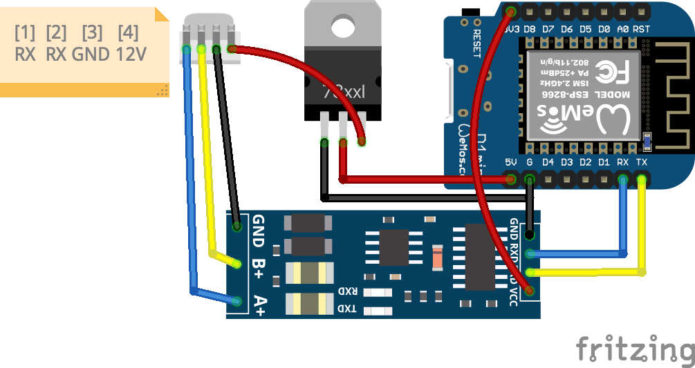

# Wemos D1 mini를 사용한 UART(RS485) 시리얼 모니터링 웹서버

RS485 네트워크의 시리얼 데이터를 무선(WiFi)으로 확인하기위한 ESP8266 프로젝트

## 기능

1. AP모드에서 사용할 와이파이 네트워크를 선택하고 저장할 수 있음
2. 클라이언트에서 웹으로 접속한 후 시리얼 데이터를 웹소켓을 통해 주고받을 수 있음
3. 프리셋 패킷저장 및 재활용 가능

### 동작 개요

- 부팅 시 SPIFFS의 /config.ini를 읽어 STA 접속을 시도함
- 접속 실패 시 AP 모드로 전환하여 WiFi 설정 페이지 제공
- 웹 UI에서 SSID/비밀번호를 저장하면 /config.ini에 "ssid;password" 형식으로 기록됨
- RS485(UART) 수신 데이터는 WebSocket 바이너리 프레임으로 브로드캐스트됨
- 웹 모니터는 HEX/ASCII 표시 전환과 프리셋 버튼 전송을 제공함

### HTTP/WS 엔드포인트

- / (index.htm) : 홈
- /monitor.htm : 시리얼 모니터
- /wifi.htm : WiFi 설정
- /ws : WebSocket (시리얼 스트림 송수신)
- /events : SSE (OTA 상태 이벤트)
- /scan : WiFi 스캔 시작
- /wifistatus : 스캔 결과 JSON
- /wifireset : 저장된 WiFi 삭제
- /connect2ssid : SSID/비밀번호 저장
- /savepreset : 프리셋 저장
- /preset.ini : 프리셋 파일

### 저장 파일

- /config.ini : "ssid;password" 형식으로 저장
- /preset.ini : 프리셋 데이터(JSON)

config.ini 파일에 "ssid;password" 형식으로 기본 접속할 Wifi 정보가 저장됨
config.ini 파일이 있는경우 wifi에 접속을 시도함
기본 SSDI로 접속이 실패하는경우 AP모드로 동작함
AP모드에서는 주변 Wifi를 검색해서 공개된 SSID를 표시함
기본 접속 SSID를 선택해서 접속하면 config.ini파일에 정보를 저장함

preset.ini 파일에 웹소켓으로 전송할 패킷 프리셋을 저장할 수 있음

## 현재 작업 상태 요약

- ✅ 안정화 완료: 웹소켓 연결 시 발생하던 리셋/예외 문제 해결
- ✅ WS 연결 직후 `client->ping()` 비활성화로 안정화 (Hello 메시지만 전송)
- ✅ WS stats 로그 간격을 1초 → 5초로 조정하여 Serial 출력 부하 감소
- ✅ 웹페이지 + WebSocket 동시 활성 상태에서 안정적 동작 확인
- ✅ 프리셋 저장(`/savepreset`) 기능 정상 동작 확인
- ✅ WiFi 스캔(`/scan`, `/wifistatus`) 기능 정상 동작 확인
- ✅ RS485 대량 데이터 전송 안정성 테스트 완료 (최대 8KB 패킷)
- ✅ Python 테스트 스크립트(`test_serial.py`) 작성 완료

**→ 실전 사용 가능 상태**

## 앞으로의 작업 계획

1. 선택적 개선 사항
   - WS ping 기능을 타이머 기반으로 재구현 (연결 유지 확인용)
   - 전송량 제한/스로틀링 옵션 추가 (필요 시)
   - 웹 UI 개선 (데이터 필터, 로그 저장 등)
2. 운영 안정성
   - OTA 펌웨어 업데이트 테스트
   - 장시간 연속 동작 안정성 모니터링
   - 전원 이상/WiFi 재연결 시나리오 테스트
3. 문서 정리
   - 트러블슈팅 가이드 추가 (ping 비활성 이유 등)
   - 사용 시나리오별 설정 가이드

## 현재 설정

- Serial baud: 74880 (부트 로그 확인용)
- ENABLE_WEBSOCKET = 1
- ENABLE_WEBPAGE = 1
- WS 연결 시 Hello 메시지 전송 (ping은 안정성 이유로 비활성)
- WS stats 로그 출력 간격: 5초
- Serial 수신 버퍼: 8192 bytes
- 패킷 타임아웃: 5ms

## 사용 가이드

### 초기 설정

1. 디바이스 부팅 시 SPIFFS의 `/config.ini` 확인
2. 파일이 없으면 AP 모드로 자동 전환 (SSID: "everyESP")
3. WiFi 연결 후 `http://192.168.4.1/wifi.htm` 접속
4. SSID/비밀번호 입력 후 저장하면 자동 재부팅

### 모니터링

1. STA 모드로 부팅 후 IP 주소 확인 (시리얼 모니터)
2. 웹 브라우저에서 `http://<IP>/monitor.htm` 접속
3. WebSocket 자동 연결되면 RS485 데이터 실시간 수신
4. HEX/ASCII 전환 가능, 프리셋 버튼으로 패킷 전송

### 트러블슈팅

- **WS 연결 시 리셋 발생**: `client->ping()` 비활성 확인 (안정성 이슈)
- **대량 데이터 전송 시 리셋**: Serial 출력 최소화, WS stats 간격 5초 유지
- **WiFi 연결 실패**: 15초 타임아웃 후 AP 모드로 자동 전환
- **OTA 업데이트**: 비밀번호 "admin", `http://<IP>:8266` (ArduinoOTA)

### 시리얼 데이터 전송 테스트

대량 데이터 수신 안정성을 테스트하려면 `test/test_serial.py` 스크립트를 사용하세요.

#### 준비

```bash
# pyserial 설치 (처음 한 번만)
pip3 install pyserial

# 시리얼 모니터 종료 (포트 충돌 방지)
```

#### 실행

```bash
cd test
python3 test_serial.py
```

#### 테스트 모드

- **모드 1**: 작은 패킷 (5바이트 × 100회) - 기본 동작 확인
- **모드 2**: 중간 패킷 (100바이트 × 50회) - 일반 통신 시뮬레이션
- **모드 3**: 큰 패킷 (1KB × 20회) - 버퍼 처리 확인
- **모드 4**: Modbus 시뮬레이션 (8바이트 × 100회) - 실전 프로토콜
- **모드 5**: 최대 버퍼 테스트 (8KB × 5회) - 한계 테스트

#### 확인 사항

- ESP가 리셋되지 않는지 (시리얼 모니터)
- WebSocket으로 모든 데이터가 수신되는지 (`/monitor.htm`)
- WS stats 로그가 5초마다 정상 출력되는지

## 사용 라이브러리

- ESP8266WiFi
- AsyncFSBrowser
- ESPAsyncTCP

## Hardware

### 구성품

- Wemos D1 mini
- XY-017 RS485-TTL convertor
- AMS1117-5V DCDC Stepdown module

### 회로

<table>
  <tr>
    <td></td>
    <td></td>
  </tr>
</table>
